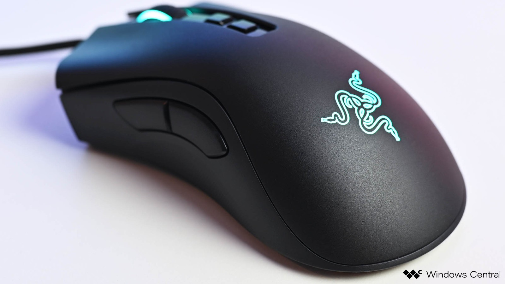
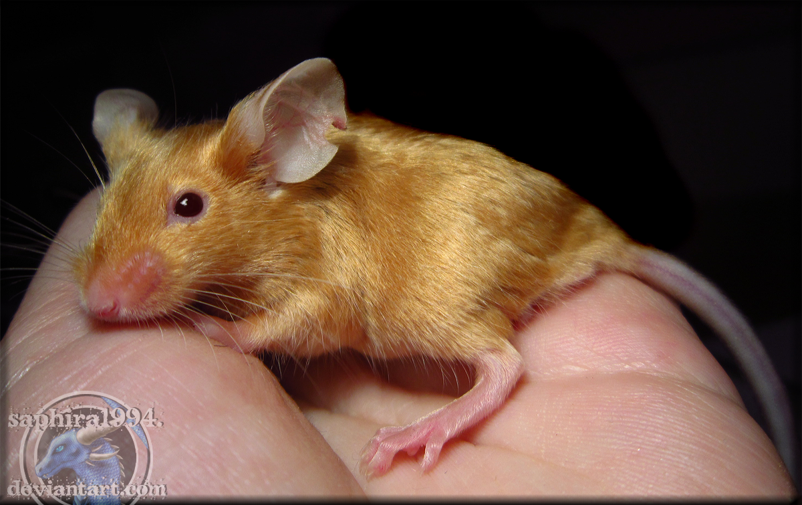
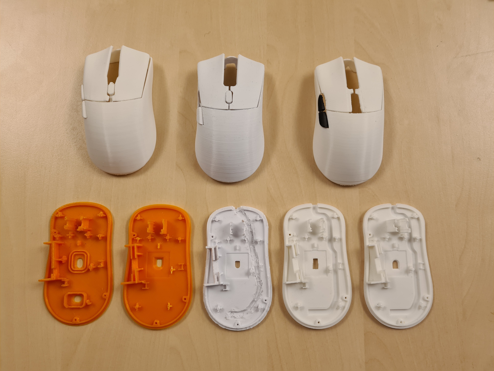
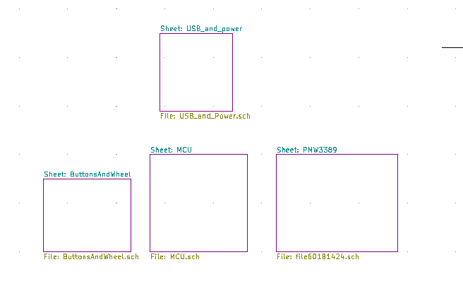
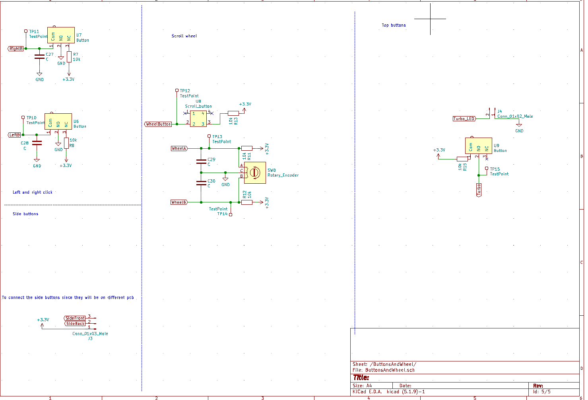
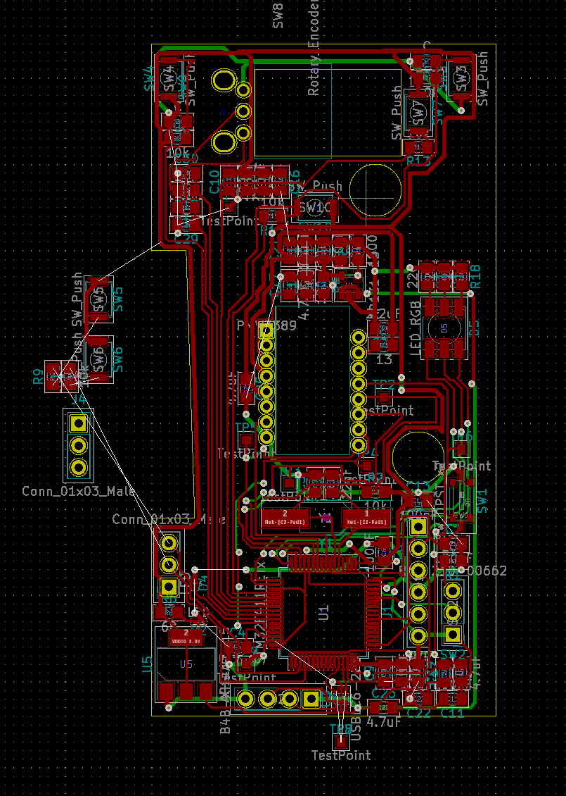
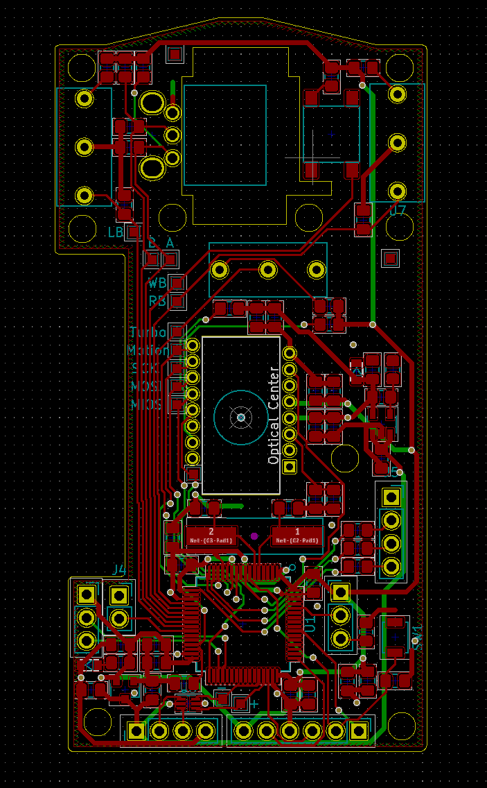
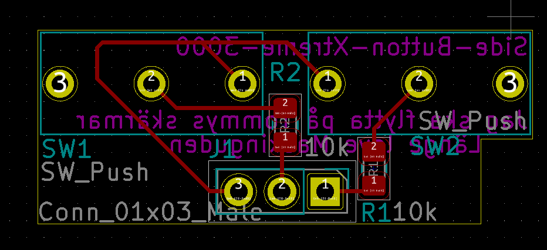
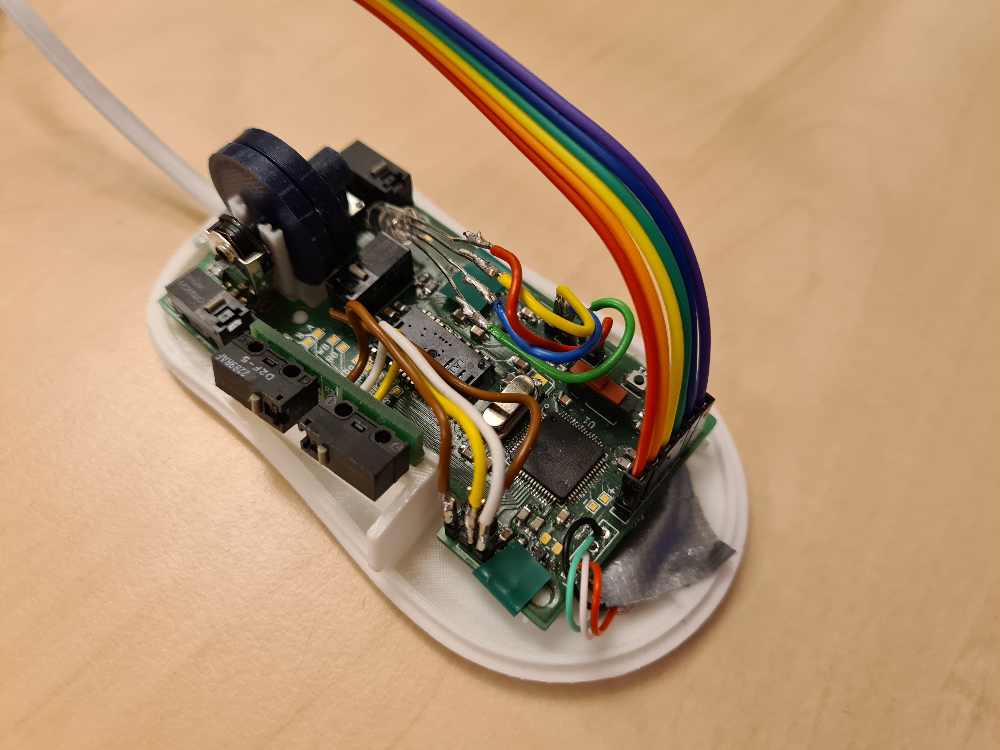
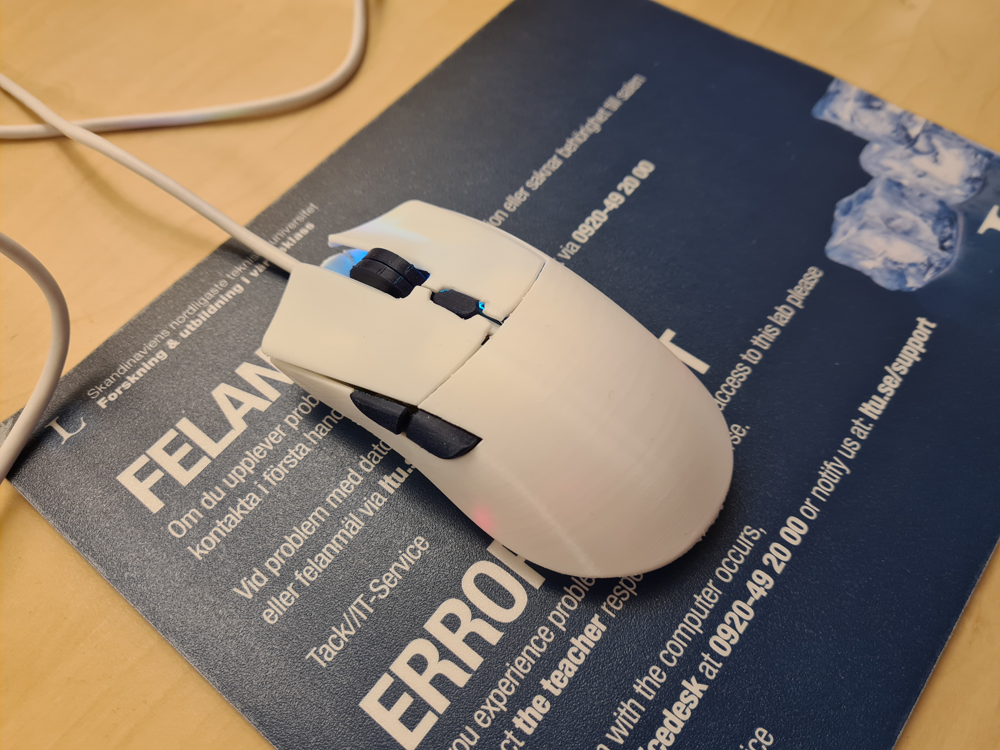

# Nuttali Presentation

Created by: 
* Tommy Andderson, anetom-6
* Samuel Gradén, samgra-7
* Jonas Jacobsson, jonjac-6

# Requirements specification/features
*   Work as an ordinary mouse
    * Left button
    * Right button
    * Scroll wheel (up and down)
    * Scroll wheel button
*   Create a mouse we could use every day
*   Working on Windows, Mac and Linux
*   Working RGB since it's a gaming mouse
*   Forward and backwards button
*   DPI/Turbo button
*   DPI/Turbo led
*   Changing RGB via software

## Goals

##### Achieved
- Works as an ordinary mouse 
- Create a mouse we could use every day
- Working on Windows, Mac and Linux.
- Working RGB

##### Almost 
- DPI/Turbo button 

##### Not Achieved
- DPI/Turbo Led
- Changing RGB via software

# Design
* Name _Nuttali_
  * Golden mouse in latin.
 
* 3D-model
  * Logitech G304/G305 
  * [Original design](https://www.thingiverse.com/thing:4084764)  
* Needed changes

* Tools used
  * Fusion 360
  * Pursa Mini in Xp-el

# Hardware
* Design choices
* Schematic
    * 
    * 
* PCB
    * First iteration
    * Second iteration
    * 
    * Third iteration (final iteration)
    * 
    * Support PCB
    * 
* Componets and footprints
    * Prioritized components
    * Customized footprints 
    * Design flaws
    * Under the hood
        *  
        
# Result

# Software

- The computer polls the mouse.
- The mouse button 1, 2 and 3, (left, right, middle) uses HID,
- The x and y posistions gets coverted to 8 bit, and sent using HID.
- Sidebuttons are mouse button 4,5 and works as forward and backwards.

# Testing and validation

* Design test
  * _Dose it feels good?_
* Operation system test
  * Windows 
  * Mac
  * Linux
* Mouse test
  * Tested with light activity for 2 hours
  * Tested gaming
    * CS
  * Tested on mouse testsites
    * https://www.onlinemictest.com/mouse-test/
    * https://www.clickspeedtest.info/mouse-test

## What works?  

- Nearly everything works on the PCB:s.
  - All buttons can be registered.
  - Encoder for the scroll wheel.
  - Sensor.
  - RGB.
- 3D-print:
  - The shell and button alignment works most of the time.
- USB communication.
  - send left, right and scroll click.
  - send up and down scroll.
  - send movement of mouse.

## Issues

- The PCB needs a few tweaks.
  - The footprint for the ESD-protection needs to change. Right now it dose not fit.
  - The footprints for the 3.3V and 1.9 converter should be changed to fit hand soldering. Right now they are troublesome to hand solder.
  - The footprint for the crystal could be a little bit smaller. Right now it takes up too much space.

## Evaluation
##### Major
- The sensor does not always register, our primary guess for the reason is that the sensor is a bit high.
- The scroll button is a bit slow.
- Hardware debounce
- Cabel

##### Minor
- More RGB Leds
- Change the resistor for the leds
- Small changes with the 3d print.
- Bigger mouse
- Scroll Wheel.

